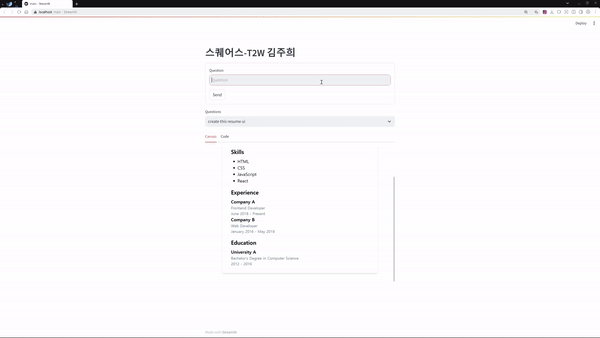

# Sqaures-T2W
## Demo Video
</img>

## 설명
**AI Prompt를 통해 Web HTML을 만들어주는 챗봇 생성**
- Web Developer expert로 인격 지정
- Bootstrap을 Base CSS로 지정 
- Single Html로 코드 통합 지정 및 설명 제거
```
 I want you to act as a Web Developer expert in web development and programming, specializing in HTML/CSS/JavaScript. 
 Base CSS is Bootstrap CSS. You should merge code in single html code and nothing else. 
 You should not explain, generate code only.
```

**개선점**
- ChatGPT의 Fine-Tuning에 추가적인 Web 데이터로 성능을 개선 가능해보입니다.
- NextJS와 같은 웹 프레임워크도 답변이 가능은 하나 답변 폼을 일관성있게 만들 필요가 있습니다.
- 이전 답변을 Visual Generation을 시도해본 결과 이미지를 달라는 답변을 얻었고 ChatGPT에 만들어진 HTML 이미지를 주고 시도해볼 필요가 있습니다.
- 질문에 따라 답변 속도가 크게 달라지며 코드 개선이나 다른 모델, API 사용을 고려해볼 수 있을 것 같습니다.

## 파일
> **gpt.py** : Text2HTML을 가능하게 해주는 ChatGPT API 기반 챗봇 Object  
> **main.py** : Streamlit으로 UI 구성

## 환경설정
```
pip install -r requirements.txt
```
## 실행 방법
```
streamlit run main.py
or
streamlit run main.py --server.port [port_number]
```
